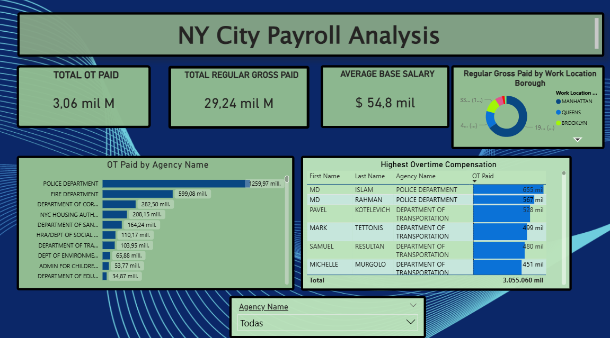

# 🗽 NYC City Payroll Analysis (2024)

## 📊 Project Overview
This interactive Power BI dashboard provides a deep dive into the New York City payroll data for the fiscal year 2024. The goal was to identify spending patterns, major overtime contributors, and departmental distributions.

## 🚀 Key Insights
* **Top Spender:** The Police Department (NYPD) represents the highest overtime expenditure.
* **Geographic Distribution:** Over 65% of the regular gross pay is concentrated in Manhattan.
* **Top Earners:** Identified the top 10 employees with the highest overtime compensation.

## 🛠️ Tools Used
* **Power BI Desktop:** Data visualization and dashboard design.
* **Power Query:** Data cleaning (filtering null names and formatting currency).
* **DAX:** Basic measures for total sums and averages.

## 📂 How to use this repo
1. Download the `.pbix` file.
2. Open it with **Power BI Desktop** to interact with the filters.
